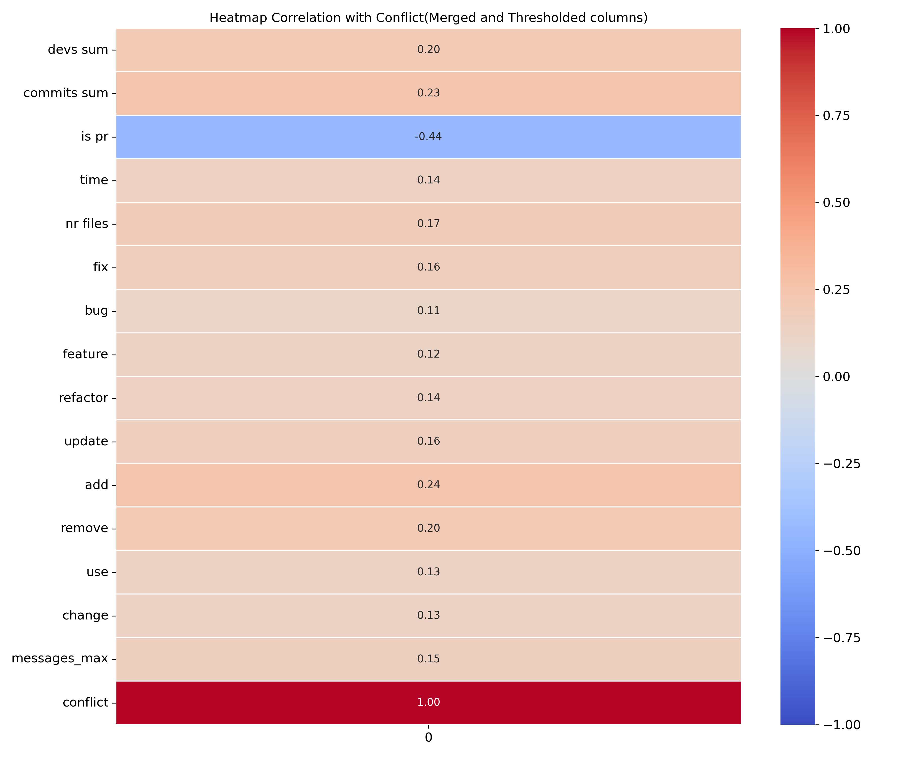

# Merge Conflicts Detector

Welcome to the Merge Conflict Detector repository! This machine learning project was designed to detect merge conflicts based on a long list of input features, such as file modifications or pull requests performed by the user.

## Table of Contents
1. [Introduction](#introduction)
2. [Architecture](#architecture)
3. [Classical Machine Learning approach](#classical-machine-learning-approach)
4. [Artificial Neural Network approach](#artificial-neural-network-approach)
5. [Setup and Installation](#setup-and-installation)
6. [Contributing](#contributing)
7. [License](#license)

## Introduction
The model is optimized for recall - meaning that the goal is to allow more false positives at the benefit of reducing false negatives to almost zero, or in more simple terms, to not allow any conflict to pass unnoticed, at the expense of a few false alarms which have to be checked in order to make sure it was indeed false. The benefit here is that a human will have a significantly reduced search space, instead of having to manually check everything, they will only have to check to make sure that what the model predicted to be a conflict is indeed a conflict.

## Architecture
Merge Conflict Detector is divided into two parts:
1. **Classical Machine Learning approach** Built with sklearn's Support Vector Classifier for capturing non-linear relationships.
2. **Artificial Neural Network approach:** Powered by Tensorflow with a neural network complex enough to capture patterns in the data.

## Classical Machine Learning approach
The first version of Merge Conflicts Detector is developed using the sci-kit learn Python library. It includes:
- **Heatmap correlation matrix** Easy visual representation of linear relationships between all input variables, as well as between each variable and the conflict outcome.
- **Support Vector Classifier:** The approximation model used for fitting a non-linear data such as when merge conflicts occur based on various input features.
- **K-Fold Cross Validation** The model is evaluated more rigurously via a 5-fold validation technique in order to mitigate random biases in the train/test partitioning that may occur, offering a better estimation of how well the model would generalize on new data.
- **Other Data Inspection Metrics** Purely for allowing the programmer to have an idea of non apparent patterns and relationships that may occur in the data, which could help them make a better informed decision.


## Artificial Neural Network approach:
The second version of Merge Conflicts Detector is developed using the Tensorflow Python library. It includes:
- **Heatmap correlation matrix** Easy visual representation of linear relationships between all input variables, as well as between each variable and the conflict outcome.
- **ANN Network:** The approximation model used for predicting is an ANN with 3 hidden layers, with 6-12-6 neurons for each layer respectively, using a linear rectifier(ReLU) function for the hidden neurons to disperse linearity, and a sigmoid activation function for the output neuron.
- **K-Fold Cross Validation** The model is evaluated more rigurously via a 5-fold validation technique in order to mitigate random biases in the train/test partitioning that may occur, offering a better estimation of how well the model would generalize on new data.
- **Other Data Inspection Metrics** Purely for allowing the programmer to have an idea of non apparent patterns and relationships that may occur in the data, which could help them make a better informed decision.




## Setup and Installation

### Prerequisites
- Python and pip
- Any code editor such as VS Code or Pycharm that supports .ipynb Jupyter notebooks

### Project Setup
1. Navigate to the project directory:
    ```sh
    cd project
    ```
2. Install requirements:
    ```sh
    pip install -r requirements.txt
    ```
3. Open the notebooks and run the code.

## Contributing
Contributions are welcome! Please fork the repository and create a pull request with your changes.

## License
This project is licensed under the MIT License. See the LICENSE file for details.
